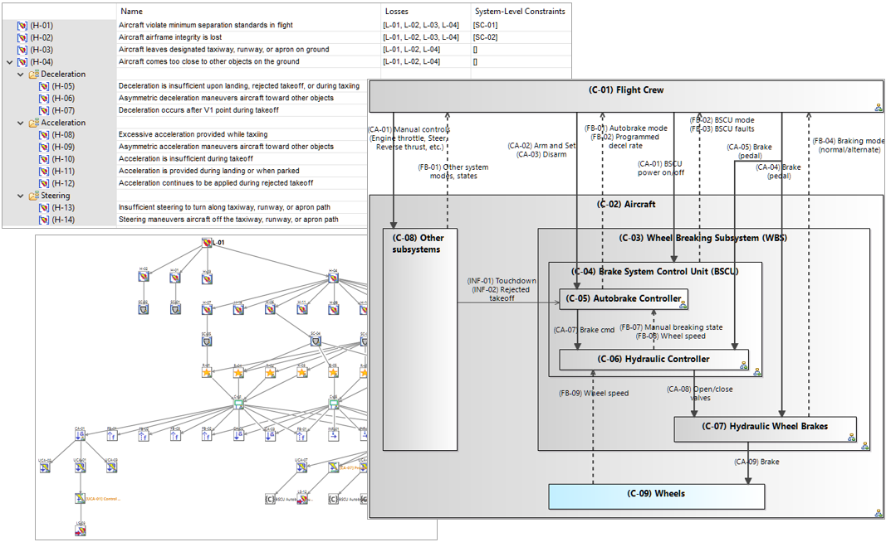

# Introduction

STPA is a widely recognised [risk analysis method by MIT](https://psas.scripts.mit.edu/home/get_file.php?name=STPA_handbook.pdf) whose growing influence is now reaching standards in, e.g., Aeronautics ([SAE AIR6913](https://www.sae.org/standards/content/air6913/)), Automotive ([SAE J3187](https://www.sae.org/standards/content/j3187_202202/)) and [others](http://psas.scripts.mit.edu/home/wp-content/uploads/2023/2023-06-08-1140__John-Thomas__PUB.pdf). It originally focuses on Safety but it can be adapted to Cybersecurity or any other concern where the notion of *control* is key. It contributes to consolidating the architecture of solutions by analysing how systems and/or humans collectively behave in order to enforce certain properties. 

This project provides *experimental* tool support for STPA. It enables system architects, designers, domain experts, safety or risk analysis experts to perform STPA analyses in a model-based fashion, either standalone or in combination with [Capella](https://eclipse.dev/capella/)/[Arcadia](https://eclipse.dev/capella/arcadia.html) system architecture modeling. Albeit experimental, it has been successfully used in several real-world projects.

A [user guide](doc/STPA-AddOn-UserGuide.pdf) is available. Familiarity with Capella or other [Sirius](https://eclipse.dev/sirius/)-based modeling tools lowers the learning curve.

[Installation instructions](https://github.com/eclipse/capella/blob/master/doc/plugins/org.polarsys.capella.ui.doc/html/Installation%20Guide/How%20to%20install%20Capella%20and%20Addons.mediawiki#Configuration-and-Extensibility) are provided as part of the Capella documentation. To sum up, download the appropriate [archive](https://github.com/labs4capella/stpa-capella/releases) according to your version of Capella.
- Either as a dropin (for example [here](https://github.com/labs4capella/stpa-capella/releases/download/v0.1.0/STPA-dropins-capella6.1-v0.1.0.zip) for Capella 6.1). To install, simply unzip it in the capella/dropins folder of your Capella installation.
- Or as an update site (for example [here](https://github.com/labs4capella/stpa-capella/releases/download/v0.1.0/STPA-updateSite-capella6.1-v0.1.0.zip) for Capella 6.1), which provides more compatibility guarantees if your  installation is more than just a simple, raw Capella or if you are unsure about its version. To install, follow the dedicated [instructions](https://github.com/eclipse/capella/blob/master/doc/plugins/org.polarsys.capella.ui.doc/html/Installation%20Guide/How%20to%20install%20Capella%20and%20Addons.mediawiki#update-sites).

 

